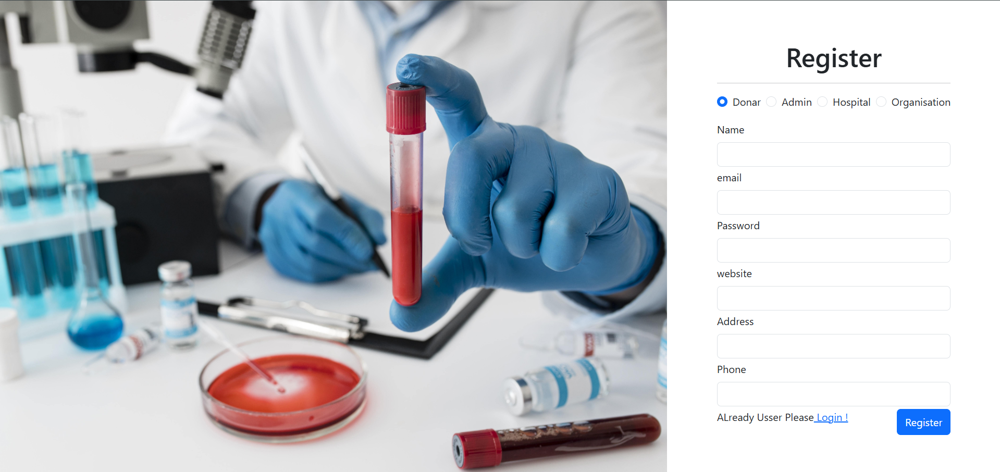
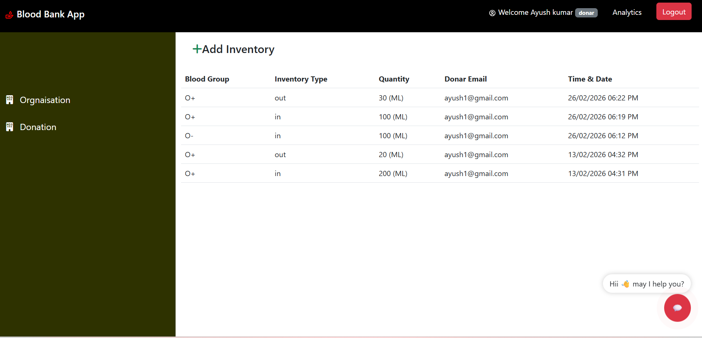

# 🩸 RED-RESERVE Blood Bank Management System

A full-stack **Blood Bank Management System** built with the **MERN Stack (MongoDB, Express, React, Node.js)** to manage blood donations, inventory, and hospital requests efficiently.

This system helps **organizations, hospitals, and donors** track blood availability and manage donation records in real time.

---

# 🚀 Features

✔ User Authentication (Admin, Donor, Hospital, Organization)
✔ Blood Donation Management
✔ Blood Inventory Tracking
✔ Hospital Blood Requests
✔ Analytics Dashboard
✔ Role Based Access Control
✔ AI Chatbot Support for Blood Queries

---

# 🛠 Tech Stack

### Frontend

* React.js
* Redux
* Bootstrap / CSS

### Backend

* Node.js
* Express.js

### Database

* MongoDB

### AI Integration

* Ollama / HuggingFace

---

# 📂 Project Structure

```
client/          → React Frontend
config/          → Database Configuration
controllers/     → Backend Logic
middlewares/     → Authentication Middlewares
models/          → MongoDB Models
routes/          → API Routes
server.js        → Backend Entry Point
```

---

# 📸 Project Screenshots

## 🔐 Register Page



---

## 🔑 Login Page


---

## 📊 Dashboard / Inventory Management



---

# ⚙️ Installation

### 1️⃣ Clone the repository

```
git clone https://github.com/ayushkumar8877/RED-RESERVE-Blood-bank-management-system-.git
```

---

### 2️⃣ Install backend dependencies

```
npm install
```

---

### 3️⃣ Install frontend dependencies

```
cd client
npm install
```

---

### 4️⃣ Run the project

Backend

```
npm run server
```

Frontend

```
cd client
npm start
```

---

# 🌐 Environment Variables

Create a `.env` file in the root directory.

```
PORT=5000
MONGO_URL=your_mongodb_connection_string
JWT_SECRET=your_secret_key
```

---

# 📊 System Modules

### 👤 Donor

* Register & Login
* Donate Blood
* View Donation History

### 🏥 Hospital

* Request Blood
* Check Blood Availability

### 🏢 Organization

* Manage Blood Inventory
* Track Blood Donations

### 👨‍💼 Admin

* Manage Users
* View Analytics

---

# 🤖 AI Chatbot

The system includes an **AI chatbot** that helps users with:

* Blood availability queries
* Donation information
* Blood group compatibility

Powered by **Ollama / HuggingFace models**.

---

# 👨‍💻 Author

**Ayush Kumar**

GitHub
https://github.com/ayushkumar8877

---

# ⭐ Support

If you like this project please ⭐ **star the repository**.
